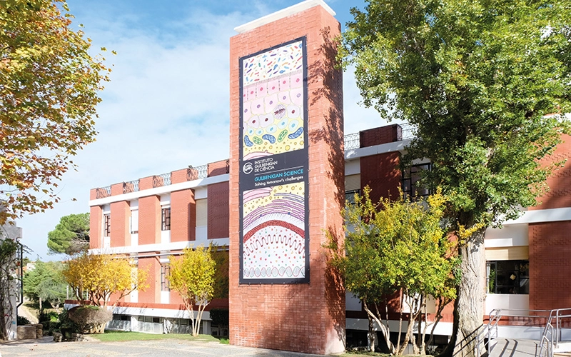

### Course Description
This is an **entry level** course for those with a biological background but **no experience** in scripting or programming. We aim to show that the automation of repetitive tasks as well as the handling of large amounts of biological data can be performed by anyone with a simple set of skills. We strongly believe that scripting extremely useful for life-scientists that are concerned with reproducibility and reliability. In this course, we will introduce bash and python 
that are readily available and easy to learn and use.

### Learning objectives
* Understanding what scripts are and how they are used.
* Getting to know important features of scripts.
* 

1. [Day 1, Intro to Bioinformatics, Sequence Data, RNA-seq](pages/Jingtao.md)
2. [Day 2, Handling Sequence Data, RNA-seq](pages/Ricardo_Leite.md)
3. [Day 3, Variant Calling / Single Cell RNA-seq](pages/Daniel_Sobral1.md)
4. [Day 4, Single Cell RNA-seq](pages/Daniel_Sobral2.md)
5. [Day 5, Using Scripts to Automate Bioinformatics Data Analysis](pages/Introduction.md)

---

### Instructors

* Pedro Fernandes
* Jingtao Lilue
* Ricardo Leite
* Daniel Sobral
* Gonçalo Leiria

---
The source for this course webpage is [on github](https://github.com/GTPB/Web_course_template).
=======
The source for this course webpage is [in github](https://github.com/GTPB/Web_course_template).

 

 Web_course_template by GTPB is licensed under a <a rel="license" href="http://creativecommons.org/licenses/by/4.0/">Creative Commons Attribution 4.0 International License</a>.
