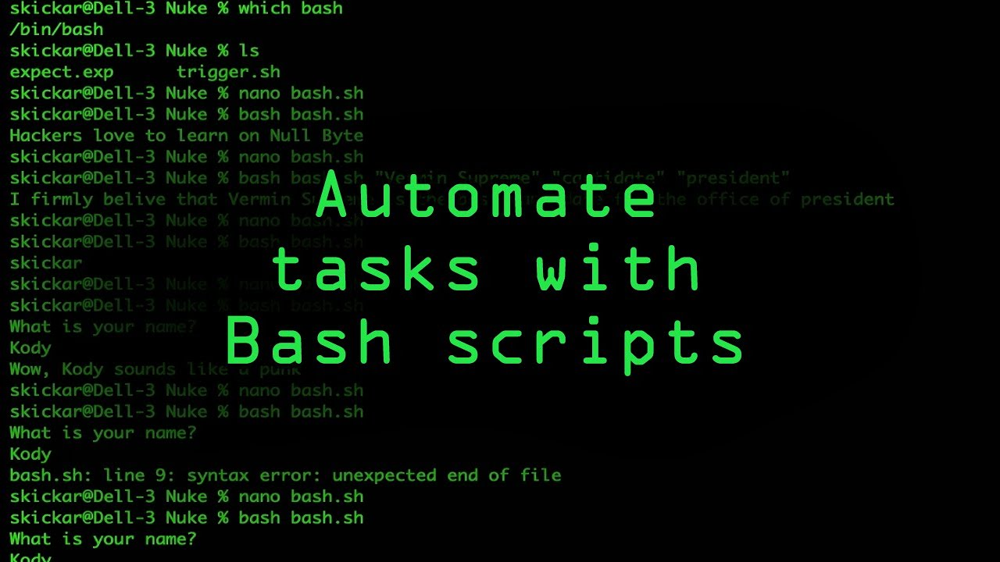

# Introduction to Scripting with Bash



### What is a script?

* A script is a text file.
* A text file file living on the disk which has some text in it.
* The text is a series of commandands which are interpreted by bash. 

### Scripting vs Programming

* Although scripting languages are programming languages, not all programming languages are 	  scripting languages.
* With one we use a **compiler**, with the other we use an **interpreter**.
* Programming languages use a **compiler** to execute code. The source code is converted to machine code using a **compiler**.The compiler translates all the source code into machine code before executing it. 
* Scripting languages use an **interpreter**. Source is converted to machine code using an interpreter.

“Scripting is a programming task that allows you to connect diverse existing components to accomplish a new related task. Scripting is the “Glue” that allows you to put various existing elements together. Programming, on the other hand, allows you to build components from scratch, as well as the applications that incorporate these components.”

* Bash is a scripting language. Bash, in Linux, allows us to **automate repetitive tasks** using its own expressions and programming logic.    

### Why are scripts useful and powerful?

* Reproducibility (...)
* Accuracy (...)
* Productivity (...)

### There are some special features in scripts:

Shibang line (tells the system how you want the script to be interpreted).

```bash
#!/bin/bash
```
It needs to be an executable.

```bash
echo ${PATH}
```

These are directories where the systems expect to find executable files.
When we type:

```bash
ls
```
or 

```bash
cd
```

What we are doing is telling Bash to go and look for an executable with the name `ls` / `cd` somewhere in the PATH. 

If it gets to the end of the PATH without finding the executable we asked for:

```bash
"command not found"
```
**Note:** if we use `./` before the command, we  are dinamically adding that specific command to the PATH. 

### Into Scripting
The idea behind scripting is to provide us a means of not just running a single command, which we can easily do directly from the command line, but to run a series of commands automatically in a single process. We run a script, and the script runs the commands for us in the order we ask it for.

### A simple script
To run our very first script, we will take a couple of commands that are often used repetively in the command line and save them into a file so that we can use them later by typing **one single command**.

Move to xxx directory and create a new file called `my_script.sh` using `nano`. 

Our script will do two things:

1) bla bla bla

2) Pedro

```bash
#!/bin/bash

echo "Number of lines:"
wc -l "$1"
```


